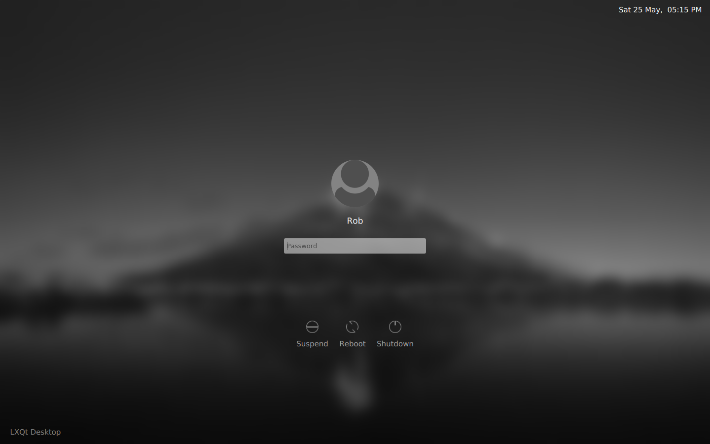
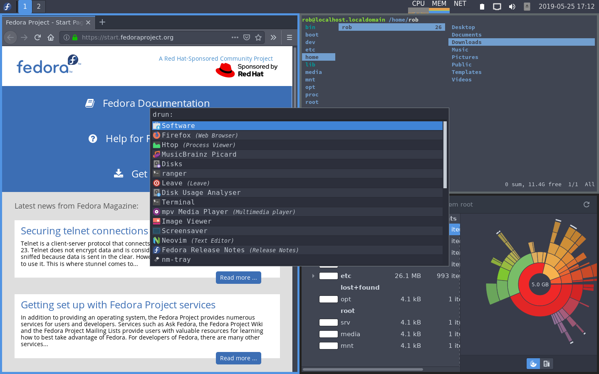
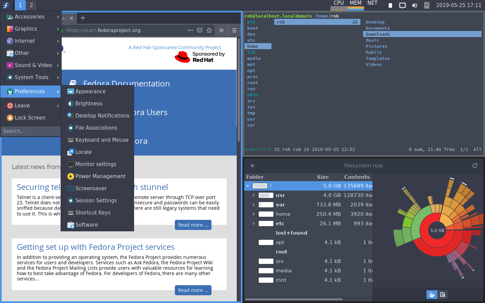

# fedora-light
A lightweight Fedora desktop using LXQT and i3wm

## Screenshots

## Components
|                  |                                                                    |
|:---------------- |:------------------------------------------------------------------ |
| Display Manager  | sddm with [chili theme](https://github.com/MarianArlt/sddm-chili)  |
| Desktop          | Minimal LXQt                                                       |
| Window Manager   | i3wm                                                               |
| App Launcher     | Rofi / LXQt Menu                                                   |
| Terminal         | Gnome Terminal                                                     |
| File Manager     | Ranger                                                             |
| Text Editor      | NeoVim                                                             |
| System Monitor   | Htop                                                               |
| Web Browser      | Firefox                                                            |
| Media Player     | MPV                                                                |
| Image Viewer     | Eye of Gnome (eog)                                                 |
| Icon Theme       | Papirus                                                            |
| App Theme        | Arc Dark                                                           |

## Setup
1. Fetch a net install iso from [here](https://alt.fedoraproject.org/)
2. Perform a minimal install of fedora
3. Boot the fresh install and login
4. Install git `sudo dnf install git`
5. Clone this repo
6. `cd fedora-light`
7. Run the installer `./install` and respond to the prompts
8. Reboot
